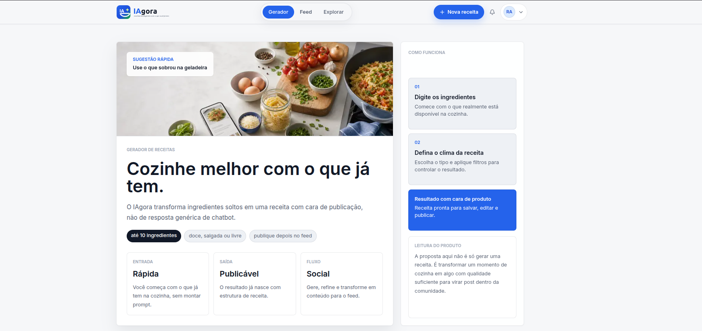
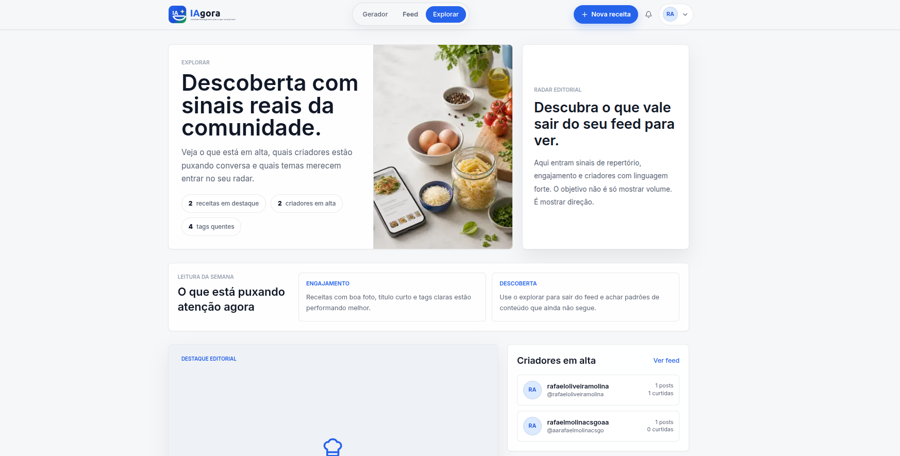
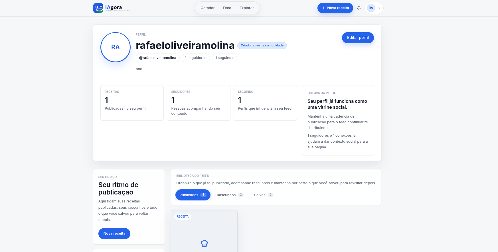

# IAgora

<p align="center">
  
</p>

<p align="center">
  Plataforma web para gerar, publicar e descobrir receitas com apoio de IA e interações sociais.
</p>

## Sobre o projeto

O **IAgora** resolve uma situação comum da rotina: olhar para os ingredientes disponíveis em casa e não saber o que preparar. A aplicação permite informar os ingredientes, escolher preferências e receber uma receita estruturada por IA.

Além do gerador, o projeto evolui essa experiência para uma comunidade de receitas: usuários podem publicar pratos, navegar por um feed público, seguir perfis, curtir, salvar e comentar receitas.

## Preview

### Gerador de receitas



### Explorar



### Perfil



## Funcionalidades

- Geração de receitas com IA a partir de ingredientes informados pelo usuário.
- Modos de geração: doce, salgada ou livre.
- Preferências e ingredientes bloqueados na geração.
- Criação, edição, publicação e exclusão de receitas.
- Upload de imagens para receitas e avatares com URL assinada do Supabase Storage.
- Feed público com busca, filtros por tag, ordenação e paginação/infinite scroll.
- Feed de receitas de perfis seguidos.
- Página de exploração com destaques, tendências e criadores em alta.
- Perfil próprio e perfil público por username.
- Curtidas, salvamentos, comentários e sistema de seguidores.
- Notificações para interações sociais.
- Coleta e painel de Web Vitals em `/performance`.
- Interface responsiva com navegação desktop e mobile.

## Stack

| Área | Tecnologias |
| --- | --- |
| Frontend | Next.js 16, React 19, TypeScript |
| Estilização | Tailwind CSS, PostCSS, `clsx`, `tailwind-merge` |
| UI e interação | Framer Motion, Lucide React, DnD Kit |
| Formulários | React Hook Form, Zod, Hookform Resolvers |
| Estado local | Zustand |
| Backend | Next.js Route Handlers |
| Autenticação | Supabase Auth com SSR |
| Banco de dados | Supabase PostgreSQL |
| Storage | Supabase Storage |
| IA generativa | Groq SDK com `llama-3.3-70b-versatile` |
| Performance | Web Vitals |

## Como foi feito

A aplicação foi construída com o **App Router do Next.js**, separando páginas, APIs e componentes por domínio. A interface usa componentes reutilizáveis em `components/`, validações compartilhadas em `lib/validations/` e clientes Supabase específicos para servidor e navegador em `lib/supabase/`.

As operações sensíveis acontecem no servidor por meio de **Route Handlers** em `app/api/**`. Esses handlers validam payloads com Zod, verificam sessão do usuário via Supabase e aplicam regras de autorização antes de gravar ou consultar dados.

A geração de receita é feita no endpoint `/api/gerar-receita`. O servidor envia um prompt estruturado para a Groq, solicita resposta em JSON e normaliza o retorno antes de validar com o schema de receita. Isso evita que a interface dependa diretamente do formato bruto retornado pela IA.

O banco usa **Row Level Security (RLS)**, triggers e contadores desnormalizados para manter consistência em curtidas, comentários, salvamentos, seguidores e receitas publicadas. Imagens são enviadas diretamente para o Supabase Storage usando URLs assinadas, reduzindo carga no servidor da aplicação.

## Arquitetura

```text
app/
  api/                 Route Handlers da aplicação
  feed/                Feed público e seguindo
  explorar/            Descoberta de tendências e criadores
  perfil/              Perfil do usuário autenticado
  performance/         Painel de Web Vitals
  receita/             Criação, detalhe e edição de receitas
  u/[username]/        Perfil público

components/
  auth/                Autenticação
  feed/                Cards, filtros e infinite scroll
  gerador/             Fluxo de geração por IA
  interacoes/          Curtir, salvar, comentar e compartilhar
  layout/              Navbar, bottom nav e containers
  perfil/              Perfil público e edição
  receita/             Editor, detalhe e upload de receita
  ui/                  Primitivos visuais

lib/
  hooks/               Hooks client-side
  stores/              Estado local com Zustand
  supabase/            Clientes, tipos e helpers do Supabase
  utils/               Helpers gerais
  validations/         Schemas Zod
  groq.ts              Cliente Groq server-side

supabase/
  migrations/          Schema, RLS, triggers, storage e políticas
```

## Banco de dados

O projeto utiliza Supabase PostgreSQL. As principais tabelas são:

| Tabela | Responsabilidade |
| --- | --- |
| `perfis` | Dados públicos do usuário, avatar, bio e contadores sociais |
| `receitas` | Receitas, ingredientes, passos, tags, publicação e métricas |
| `curtidas` | Relação usuário-receita para likes |
| `salvamentos` | Receitas salvas pelo usuário |
| `comentarios` | Comentários por receita |
| `seguidores` | Relação entre seguidor e perfil seguido |
| `notificacoes` | Eventos sociais exibidos ao usuário |
| `web_vitals_events` | Métricas reais de performance coletadas no app |

As migrations ficam em `supabase/migrations/` e incluem:

- schema inicial;
- políticas RLS;
- triggers e funções de contadores;
- configuração de buckets de storage;
- políticas para notificações e comentários;
- campo `published_at` para ordenação de publicações.

## APIs

### Autenticação

| Método | Rota | Descrição |
| --- | --- | --- |
| `POST` | `/api/auth/cadastro` | Cria usuário e perfil |
| `POST` | `/api/auth/login` | Autentica usuário |
| `POST` | `/api/auth/logout` | Encerra sessão |

### Receitas

| Método | Rota | Descrição |
| --- | --- | --- |
| `GET` | `/api/receitas` | Lista receitas com filtros e paginação |
| `POST` | `/api/receitas` | Cria receita |
| `GET` | `/api/receitas/[id]` | Busca detalhe da receita |
| `PATCH` | `/api/receitas/[id]` | Atualiza receita do autor |
| `DELETE` | `/api/receitas/[id]` | Remove receita do autor |
| `POST` | `/api/receitas/[id]/curtir` | Curte receita |
| `DELETE` | `/api/receitas/[id]/curtir` | Remove curtida |
| `POST` | `/api/receitas/[id]/salvar` | Salva receita |
| `DELETE` | `/api/receitas/[id]/salvar` | Remove salvamento |
| `GET` | `/api/receitas/[id]/comentarios` | Lista comentários |
| `POST` | `/api/receitas/[id]/comentarios` | Cria comentário |
| `DELETE` | `/api/comentarios/[id]` | Exclui comentário |

### Comunidade, IA e métricas

| Método | Rota | Descrição |
| --- | --- | --- |
| `GET` | `/api/perfil` | Retorna perfil autenticado |
| `PATCH` | `/api/perfil` | Atualiza perfil autenticado |
| `POST` | `/api/seguidores/[id]` | Segue um perfil |
| `DELETE` | `/api/seguidores/[id]` | Deixa de seguir um perfil |
| `GET` | `/api/notificacoes` | Lista notificações |
| `PATCH` | `/api/notificacoes` | Marca notificações como lidas |
| `DELETE` | `/api/notificacoes` | Limpa notificações |
| `POST` | `/api/gerar-receita` | Gera receita por IA |
| `POST` | `/api/upload` | Cria URL assinada para upload |
| `GET` | `/api/analytics/web-vitals` | Consulta métricas de performance |
| `POST` | `/api/analytics/web-vitals` | Registra métricas de performance |

## Rotas da aplicação

| Rota | Descrição | Acesso |
| --- | --- | --- |
| `/` | Gerador de receitas com IA | Público |
| `/feed` | Feed da comunidade | Público |
| `/explorar` | Descoberta de tendências e criadores | Público |
| `/receita/[id]` | Detalhe de receita | Público |
| `/u/[username]` | Perfil público | Público |
| `/login` | Login | Público |
| `/cadastro` | Cadastro | Público |
| `/receita/nova` | Nova receita | Autenticado |
| `/receita/[id]/editar` | Edição de receita | Autor autenticado |
| `/perfil` | Perfil próprio | Autenticado |
| `/perfil/editar` | Edição de perfil | Autenticado |
| `/performance` | Painel de Web Vitals | Público |

As rotas privadas são protegidas em `proxy.ts`.

## Requisitos

- Node.js `>=20.9.0`
- npm
- Projeto Supabase configurado
- Chave de API da Groq

## Como rodar localmente

Clone o repositório e instale as dependências:

```bash
npm install
```

Crie o arquivo de ambiente:

```bash
cp .env.local.example .env.local
```

Preencha as variáveis obrigatórias:

```env
GROQ_API_KEY=
NEXT_PUBLIC_SUPABASE_URL=
NEXT_PUBLIC_SUPABASE_ANON_KEY=
```

Execute as migrations SQL em `supabase/migrations/` no projeto Supabase, respeitando a ordem dos arquivos.

Inicie o servidor de desenvolvimento:

```bash
npm run dev
```

Acesse:

```text
http://localhost:3000
```

## Scripts

| Script | Comando | Descrição |
| --- | --- | --- |
| `dev` | `npm run dev` | Remove service workers antigos e inicia o Next em desenvolvimento |
| `build` | `npm run build` | Gera build de produção |
| `start` | `npm run start` | Executa a aplicação após build |
| `lint` | `npm run lint` | Executa ESLint no projeto |

## Qualidade e segurança

- TypeScript com `strict` habilitado.
- Validação de dados com Zod no cliente e no servidor.
- Autorização server-side nos handlers de API.
- Supabase RLS nas tabelas de domínio.
- Upload por URL assinada em buckets restritos por usuário.
- Proteção de rotas autenticadas via `proxy.ts`.
- Contadores sociais mantidos por triggers no banco.
- Coleta de Web Vitals para monitoramento de performance real.

## Deploy

O deploy recomendado é na **Vercel**.

1. Conecte o repositório à Vercel.
2. Configure as variáveis de ambiente:
   - `GROQ_API_KEY`
   - `NEXT_PUBLIC_SUPABASE_URL`
   - `NEXT_PUBLIC_SUPABASE_ANON_KEY`
3. Execute as migrations no Supabase.
4. Publique o projeto.

## Status

Projeto em desenvolvimento ativo. O repositório ainda não possui suíte de testes automatizados configurada.

## Licença

Este projeto ainda não possui uma licença definida.
